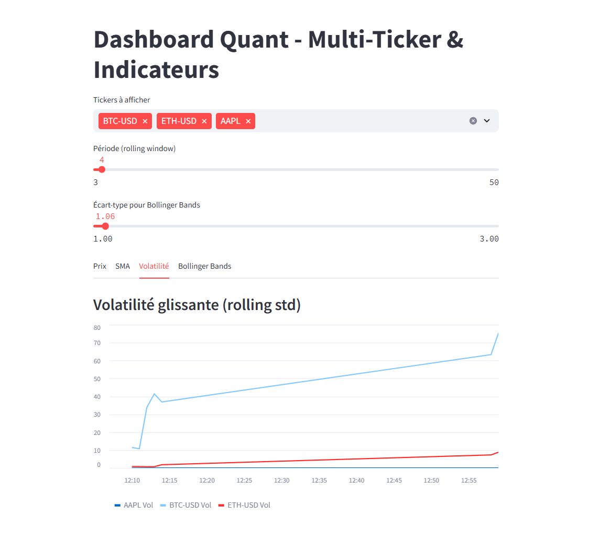

#  Real-Time Market Data Pipeline

  

This project is a real-time multi-ticker data pipeline fetching market data using Yahoo Finance API, visualized through a Streamlit dashboard, and fully dockerized for easy deployment.

---

##  Features

- Fetches real-time data for multiple tickers (AAPL, MSFT, BTC-USD, etc.)
- Streamlit dashboard displaying:
  - Simple Moving Average (SMA)
  - Rolling Volatility
  - Bollinger Bands
- Modular architecture: data collector + dashboard
- Full Docker support for deployment

---

##  Project Structure

market-pipeline/  
├── data_collector/  
│ ├── main.py  
│ └── yahoo_fetcher.py  
├── dashboard/  
│ └── app.py  
├── storage/  
│ └── save_parquet.py  
├── data/ (ignored by .gitignore)  
├── Dockerfile.collector  
├── Dockerfile.dashboard  
├── docker-compose.yml  
├── requirements.txt  
├── README.md  
├── .gitignore

---

##  How to Run

```bash
1. Clone the repo:

git clone https://github.com/.../Market_Pipeline.git
cd Market_Pipeline


2. Build and run with Docker:

docker compose up --build


3. Access the dashboard at : 

http://localhost:8501
```

---

## AUTHOR

Elliot Piet  
Quant | Data Engineer

